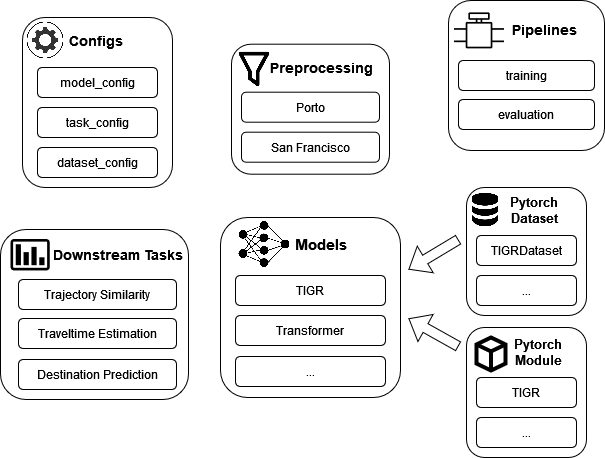

<!-- ABOUT THE PROJECT -->
<!-- ## About The Project -->
# A framework for Trajectory Representation Learning (TRL)

Trajectory Representation Learning (TRL) encodes raw spatio-temporal data into a compact feature vector, capturing essential trajectory characteristics. 
This simplifies data analysis and removes the need for manual feature engineering and task-specific models. 
Thus TRL facilitates the utilization of trajectory data for various downstream applications. 
With this TRL framework, we provide researchers with a framework for training and evaluating existing TRL methods on various downstream tasks and data sets, and creating new TRL methods.
Moreover, the framework is easily extensible to more tasks, datasets, and baselines. 
The framework is implemented with pytorch-lightning and supports various training and validation visualizations in TensorBoard. 

Currently, the TRL framework supports the following methods, datasets, and tasks (in brackets are the command names for utilizing the specific method, dataset or task within the framework):

TRL methods:
* TIGR (tigr)
* [Transformer](https://arxiv.org/abs/1706.03762) (transformer)
* [t2vec](https://xiucheng.org/assets/pdfs/icde18-t2vec.pdf) (t2vec)
* [CLT-Sim](https://zheng-kai.com/paper/cikm_2022_deng.pdf) (cltsim)
* [CSTTE](https://arxiv.org/pdf/2207.14539v1) (cstte)
* [TrajCL](https://arxiv.org/pdf/2210.05155) (trajcl)
* [Trembr](https://dl.acm.org/doi/pdf/10.1145/3361741) (trembr)
* [Toast](https://xiucheng.org/assets/pdfs/cikm21-rnr.pdf) (toast)
* [JCLRNT](https://arxiv.org/pdf/2209.06389) (jclm)
* [LightPath](https://arxiv.org/abs/2307.10171) (lightpath)
* [START](https://arxiv.org/abs/2211.09510) (start)

Datasets:
* [Porto](https://www.kaggle.com/competitions/pkdd-15-taxi-trip-time-prediction-ii) (porto)
* [San Francisco](https://ieee-dataport.org/open-access/crawdad-epflmobility) (sf)

Downstream tasks:
* Trajectory Similarity Computation (traj_sim)
* Traveltime Estimation (traveltime)
* Destination Prediction (destination)


## Framework 



**Configs:** Contains config files for the methods, downstream tasks, and dataset preprocessing.
* model_config - Set all hyperparameters for the specific model.
* task_config - Set parameters for the specific downstream task.
* dataset_config - Set parameters for the dataset preprocessing.

**Preprocessing:**
Responsible for preprocessing the specific dataset.

**Pipelines:**
Pipeline for training and evaluation of a method.

**Downstream Tasks:**
Implemented Downstream Tasks that can be used to evaluate pre-trained TRL methods.

**Models:**
Here the TRL method implementations are stored and are further divided into the model implementations and the dataset implementations. 
To create a new model, it needs to have its model_config, which references the implemented PyTorch Dataset and Module, which needs to follow the BaseModel structure.


<!-- GETTING STARTED -->

## Quick-Start

### Prerequisites
To install the required packages we recommend using [Conda](https://docs.conda.io/en/latest/). Our used environment can be easily installed with conda.

### Installation

1. Clone the repo
   ```sh
   git clone https://github.com/...
   ```
2. Install conda environment
   ```sh
   conda config --env --set channel_priority strict
   conda env create -f environment.yml
   ```
3. Activate the environment
   ```sh
   conda activate trl
   ```

<!-- USAGE EXAMPLES -->


### Datasets 

Download San Francisco or Porto Dataset.

* [San Francisco](https://ieee-dataport.org/open-access/crawdad-epflmobility)
* [Porto](https://www.kaggle.com/datasets/crailtap/taxi-trajectory)


### Preprocessing

For preprocessing use the following notebook:

```sh
preprocessing
├── porto.ipynb
└── sf.ipynb
```

### Training and Evaluation

1. Train Model with 
   ```sh
   python train.py --model <model_name>
   ```
2. Evaluate Model with 
   ```sh
   python evaluate.py --model <model_name> --task <task_name>
   ```

Implemented Models that can be trained and evaluated:
* tigr (TIGR)
* transformer (Transformer)
* t2vec (T2Vec)
* cltsim (CLT-Sim)
* cstte (CSTTE)
* trajcl (TrajCL)
* trembr (Trembr)
* toast (Toast)
* jclm (JCLRNT)
* lightpath (LightPath)
* start (START)

Implemented Downstream Tasks for Evaluation:
* traj_sim (Trajectory Similarity Computation)
* traveltime (Travel Time Estimation)
* destination (Destination Prediction)

